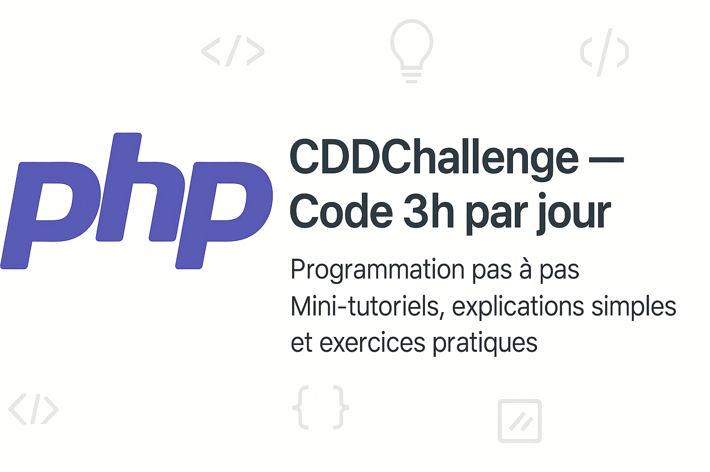

# PHP Débutant – Apprendre en codant
Programmation en PHP pas à pas

Bienvenue sur mon dépôt GitHub où je documente mon apprentissage de PHP, pas à pas, à travers des mini-tutoriels pratiques, simples, pensés pour les débutants et évoluer progressivement.
Chaque dossier contient un mini-tutoriel, un exemple de code, et une explication simple.

> Objectif : apprendre PHP en construisant et en partageant des petits bouts de code utiles, sans jargon inutile ni complexité prématurée.
> Rendre la programmation en PHP accessible aux vrais débutants, avec des mini-tutos simples, clairs, et sans bla-bla.

Mon projet principal :
[👉 php-debutant-tutos](https://github.com/YSonz/php-beginner-tutos)

Ce que tu trouveras :
- Des mini-exercices PHP pratiques
- Des explications pour ceux qui commencent de zéro
- Des idées de projets faciles à coder

---

## Tutoriels disponibles

Chaque dossier contient :
- Du **code prêt à exécuter**
- Des **explications claires**
- Un **exercice** ou une mini-démo

| # | Sujet                              | Lien                       |
|---|------------------------------------|----------------------------|
| 1 | Variables                          | [`01-variable`](tutoriels/01-variable) |
| 2 | Conditions `if / else`             | [`02-conditions`](tutoriels/02-conditions) |
| 3 | Formulaire + `$_POST`              | [`03-formulaire-post`](tutoriels/03-formulaire-post) |
| 4 | Tableaux + boucle `foreach`        | [`04-tableau-foreach`](tutoriels/04-tableau-foreach) |

> D’autres tutoriels arrivent chaque semaine !

---
Tu peux me suivre ici :
- LinkedIn : [Sonzia Teutsong Marie-Audrey](https://linkedin.com/in/sonzia-teutsong)
- GitHub : [YSonz](https://github.com/YSonz)

## Prérequis

Pour tester les fichiers `.php`, tu peux utiliser :
- Un serveur local comme **[XAMPP](https://www.apachefriends.org/fr/index.html)** ou **[MAMP](https://www.mamp.info/)**
- Ou un outil en ligne
---

## Pourquoi ce dépôt ?

Je suis passionné par la programmation PHP et j’ai décidé de documenter mon apprentissage publiquement pour :
- Garder une trace de mes progrès
- Aider d’autres débutants à ne pas se décourager
- Créer une base simple pour apprendre PHP pas à pas

> Ce dépôt est un **journal de progression** + une **boîte à outils** pour ceux qui commencent.

---

## Me suivre / contribuer

Tu peux :
- **Mettre une étoile** à ce repo pour suivre ma progression
- **Contribuer** avec une correction, un exemple ou une amélioration
- **Me suggérer** un sujet de tutoriel (issues ouvertes !)

---

## Licence

[MIT](LICENSE) – utilise ce contenu librement, mentionne la source si tu le partages.

---

> Merci d’être là. Bon apprentissage à toi aussi !
